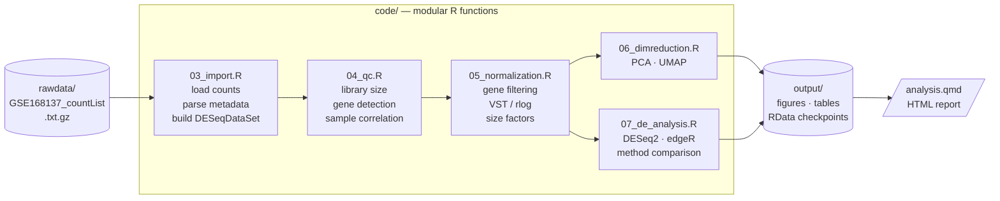

# bulkRNAseq — Modular Bulk RNA-seq Analysis Pipeline

> A modular, reproducible R pipeline for bulk RNA-seq differential expression analysis.
> Demonstrated on **GSE168137**: a 192-sample 5xFAD Alzheimer mouse model dataset spanning
> four timepoints, two brain regions, and both sexes.


---

## The problem this pipeline solves

Bulk RNA-seq analysis involves a sequence of methodological choices — gene filtering
thresholds, normalisation strategy, design formula, LFC shrinkage method — where each
decision compounds downstream. Most published pipelines treat these as fixed defaults.
This pipeline makes every choice explicit, documents the rationale, and provides a
direct comparison between **DESeq2** and **edgeR** so you can audit where the methods agree
and where they diverge.

Metadata parsing is automatic: sample groups (genotype, tissue, age, sex) are inferred
directly from GEO column names with no manual annotation step.

---

## Dataset

| Field | Value |
|---|---|
| GEO accession | [GSE168137](https://www.ncbi.nlm.nih.gov/geo/query/acc.cgi?acc=GSE168137) |
| Publication | Forner et al., *Scientific Data* 2021 — [doi:10.1038/s41597-021-01054-y](https://doi.org/10.1038/s41597-021-01054-y) |
| Model | 5xFAD transgenic vs C57BL/6J wild-type |
| Tissue | Cortex, hippocampus (microdissected) |
| Ages | 4, 8, 12, 18 months |
| Sex | Female, Male |
| Samples | 192 total |
| Platform | Illumina NextSeq 500 |
| Organism | *Mus musculus* (GRCm38) |

The count matrix (`GSE168137_countList.txt.gz`) contains raw read counts per gene per sample.
All metadata is encoded in column names and parsed automatically at import.

---

## Pipeline overview



---

## Repository structure

```
bulkRNAseq/
├── analysis.qmd              ← Main Quarto notebook (entry point)
├── rawdata/                  ← Immutable raw input — read-only
│   ├── GSE168137_countList.txt.gz      ← Primary input: raw counts
│   ├── GSE168137_expressionList.txt.gz ← GEO-normalised (not used for DE)
│   └── GSE168137_series_matrix.txt.gz  ← SOFT metadata
├── code/                     ← Modular R helper functions
│   ├── 00_packages.R         ← pak-based package loading and installation
│   ├── 01_global_variables.R ← Thresholds, colour palettes, plot theme
│   ├── 02_utils.R            ← Checkpoint system, save_plot(), save_table()
│   ├── 03_import.R           ← Data loading, metadata parsing, subsetting
│   ├── 04_qc.R               ← Per-sample QC metrics and plots
│   ├── 05_normalization.R    ← Gene filtering, VST/rlog, size factors
│   ├── 06_dimreduction.R     ← PCA and UMAP on VST-normalised data
│   └── 07_de_analysis.R      ← DESeq2, edgeR, cross-method comparison
├── output/                   ← All analysis outputs (auto-created)
│   ├── figures/              ← Plots: QC, PCA, UMAP, volcano, heatmap
│   ├── tables/               ← TSV results: QC metrics, DE gene lists
│   ├── reports/              ← Rendered HTML reports
│   └── RData/                ← Checkpoint .rds files (crash recovery)
├── data/                     ← Processed intermediate data
├── config/                   ← Analysis configuration files
├── docs/                     ← Additional documentation
├── envs/
│   ├── environment.yml       ← Conda environment (optional)
│   └── requirements.txt      ← Python dependencies (optional)
└── README.md
```

---

## Setup

The pipeline is pure R (≥ 4.4). All packages are installed automatically via
[`pak`](https://pak.r-lib.org/) on first run — no manual `install.packages()` required.

### 1. Clone the repository

```bash
git clone https://github.com/SLopezBegines/bulkRNAseq.git
cd bulkRNAseq
```

### 2. Download the raw data

The raw count matrix is not tracked in git (9 MB). Download directly from GEO:

```bash
cd rawdata/
wget https://ftp.ncbi.nlm.nih.gov/geo/series/GSE168nnn/GSE168137/suppl/GSE168137_countList.txt.gz
wget https://ftp.ncbi.nlm.nih.gov/geo/series/GSE168nnn/GSE168137/suppl/GSE168137_expressionList.txt.gz
```

Or use the GEO accession page: [GSE168137](https://www.ncbi.nlm.nih.gov/geo/query/acc.cgi?acc=GSE168137).

### 3. Open the project in RStudio

Open `analysis.qmd`. On the first run, `code/00_packages.R` will install all missing
packages (DESeq2, edgeR, ggplot2, uwot, pheatmap, and others). This takes ~5 minutes.

### 4. Render the notebook

```r
# From the R console, with the project directory as working directory:
quarto::quarto_render("analysis.qmd")
```

Or click **Render** in RStudio. The output HTML is written to `output/reports/`.

---

## Running the analysis

All analysis parameters are set in the first chunk of `analysis.qmd`.
No other files need to be edited for a standard run.

### Subsetting the experiment

The full dataset is 192 samples across 4 timepoints, 2 tissues, 2 sexes, and 2 genotypes.
A typical analysis focuses on one tissue and/or a subset of timepoints:

```r
# analysis.qmd — Parameters chunk
TISSUE_FILTER <- "cortex"          # "cortex" | "hippocampus" | NULL (both)
AGE_FILTER    <- NULL              # e.g. c(4, 8) | NULL (all timepoints)
SEX_FILTER    <- NULL              # "Female" | "Male" | NULL (both)
```

### DESeq2 design formula

The design formula controls which covariates are included in the linear model.
The last term is always the main contrast variable (`genotype`):

```r
DE_DESIGN <- ~ sex + age_months + genotype   # Full model (recommended)
DE_DESIGN <- ~ genotype                       # Genotype only (single timepoint)
DE_DESIGN <- ~ sex + genotype                 # Without age (if subsetting to one age)
```

---

## Key parameters

All thresholds are defined in `code/01_global_variables.R` and can be overridden in the
Parameters chunk of `analysis.qmd`.

| Parameter | Default | Description |
|---|---|---|
| `P_VAL_THRESH` | `0.05` | Adjusted p-value cutoff (padj / FDR) |
| `FC_THRESH` | `1.0` | \|log₂FC\| threshold for calling a gene DE |
| `MIN_COUNT_CPM` | `1` | Minimum CPM a gene must reach in at least `MIN_SAMPLES_EXPRESSED` samples |
| `MIN_SAMPLES_EXPRESSED` | `3` | Minimum number of samples meeting `MIN_COUNT_CPM` |
| `MIN_TOTAL_COUNTS` | `10` | Minimum total counts across all samples per gene |
| `NORM_METHOD` | `"vst"` | Normalisation for visualisation: `"vst"` (n>30) or `"rlog"` (n<30) |
| `SHRINK_TYPE` | `"apeglm"` | DESeq2 LFC shrinkage method: `"apeglm"` \| `"ashr"` |
| `N_TOP_GENES_PCA` | `500` | Most variable genes used for PCA |
| `N_PCS_UMAP` | `15` | PCs passed to UMAP |
| `UMAP_SEED` | `42` | Random seed for UMAP reproducibility |
| `QC_MIN_LIBRARY_SIZE` | `1,000,000` | Samples below this are flagged in QC |

### Why apeglm shrinkage?

`apeglm` (adaptive t prior) produces the lowest mean squared error for LFC estimates
across a range of expression levels and is recommended for downstream gene set analysis.
Switch to `ashr` if the coefficient name cannot be resolved automatically (e.g. in
designs with interaction terms).

---

## Outputs

Each section of the notebook saves plots and tables to `output/` automatically.

| Section | Figures | Tables |
|---|---|---|
| QC | Library size barplot, gene detection boxplot, sample correlation heatmap | `sample_QC_metrics.tsv` |
| Normalisation | Size factor plot, mean-SD plot | — |
| PCA | Scree plot, PCA grid (4 covariates), PCA by genotype, PCA by age | — |
| UMAP | UMAP grid (4 covariates), UMAP by genotype, UMAP by age | — |
| DESeq2 | Volcano plot, MA plot, top-50 DE heatmap | `DESeq2_5xFAD_vs_BL6.tsv` |
| edgeR | Volcano plot, MA plot, top-50 DE heatmap | `edgeR_5xFAD_vs_BL6.tsv` |
| Comparison | LFC scatter, p-value rank plot, side-by-side volcanos | `concordant_DE_genes.tsv`, `DESeq2_edgeR_merged.tsv` |

Figures are saved in both **PDF** (vector, publication-ready) and **TIFF** (300 dpi, journal submission).

### Crash recovery — checkpoint system

Long-running steps (DESeq2, edgeR) are checkpointed automatically to `output/RData/`.
If the session crashes, the notebook resumes from the last checkpoint without rerunning
the full model fit:

```r
if (check_checkpoint("deseq2_res")) {
  deseq2_res <- load_checkpoint("deseq2_res")
} else {
  deseq2_res <- run_deseq2(...)
  save_checkpoint(deseq2_res, "deseq2_res")
}
```

---

## The non-obvious things

### 1. One count was not an integer

`ENSMUSG00000000028` has a count of `39.42` in one sample in the original GEO file.
The pipeline rounds all counts to integers at import (`round()` before `storage.mode <- "integer"`).
Always check for fractional counts when loading data directly from GEO supplementary files.

### 2. Metadata is entirely in the column names

GEO did not provide a separate sample sheet. The pipeline parses genotype, tissue, age,
sex, and animal ID from the column name convention
(`5xFAD;BL6_cortex_4mon_Female_430` → genotype = `5xFAD`, tissue = `cortex`, age = `4`,
sex = `Female`, id = `430`) using a single regex function in `03_import.R`.

### 3. VST vs rlog

With 192 samples, VST is fast and appropriate. If you subset to fewer than ~30 samples
(e.g. a single timepoint × tissue × sex), switch to `rlog` in the Parameters chunk —
it handles small n better at the cost of runtime.

### 4. DESeq2 and edgeR give different answers — and that is informative

With well-powered data, concordance is high (typically > 80% of significant genes
shared). Discordant genes are usually at the extremes of count distributions. The
pipeline reports Jaccard overlap, LFC correlation, and p-value rank plots so you can
quantify — and explain — any divergence.

---

## Troubleshooting

**`pak` fails to install a Bioconductor package**
Make sure your R version is ≥ 4.4 and that `BiocManager` can access your Bioconductor
mirror. On Linux, some packages require system libraries:
```bash
sudo apt-get install -y libcurl4-openssl-dev libssl-dev libxml2-dev libhdf5-dev
```

**`apeglm` shrinkage throws `coefficient not found`**
This happens when the factor levels of `genotype` in `colData(dds)` do not match the
expected pattern `genotype_5xFAD_vs_BL6`. Verify the reference level:
```r
levels(dds$genotype)  # Should be: "BL6" "5xFAD"
```
`build_dds()` sets `BL6` as the reference automatically. If you relevel manually
downstream, the coefficient name changes accordingly.

**UMAP gives different coordinates every run**
`UMAP_SEED` in `01_global_variables.R` controls the seed. It is passed to `set.seed()`
immediately before `uwot::umap()`. If you changed the default, reset it to `42`.

**Quarto render fails with `object 'output_path' not found`**
The `output_path` variable is defined in the Parameters chunk of `analysis.qmd`, which
must run before the Setup chunk. If chunks are executed out of order in the IDE,
run the Parameters chunk first manually.

**Memory error with the full 192-sample dataset**
VST on 55,000 × 192 is memory-intensive. Minimum recommended RAM: 16 GB.
Run gene filtering (`filter_low_counts()`) before building the DESeqDataSet to reduce
the matrix to ~15,000–20,000 genes.

---

## Tested environment

| Component | Version |
|---|---|
| R | 4.4.1 |
| Quarto | 1.5.x |
| DESeq2 | 1.44.x |
| edgeR | 4.2.x |
| uwot | 0.2.x |
| OS | Ubuntu 22.04 |

---

## Related

- **Portfolio:** [slopezbegines.github.io](https://slopezbegines.github.io)
- **A1 — LFQ Proteomics pipeline:** [SLopezBegines/Proteomics](https://github.com/SLopezBegines/Proteomics)
- **A2 — snRNA-seq pipeline:** [SLopezBegines/snRNAseq_mouse](https://github.com/SLopezBegines/snRNAseq_mouse)
- **Dataset on GEO:** [GSE168137](https://www.ncbi.nlm.nih.gov/geo/query/acc.cgi?acc=GSE168137)
- **UCI Mouse Explorer:** [mousebrain.uci.edu](https://mousebrain.uci.edu)
- **AD Knowledge Portal:** [adknowledgeportal.synapse.org](https://adknowledgeportal.synapse.org)

---

## Citation

If you use this pipeline or the GSE168137 dataset in your work, please cite the original
data publication:

> Forner S, Kawauchi S, Balderrama-Gutierrez G, et al.
> Systematic phenotyping and characterization of the 5xFAD mouse model of Alzheimer's disease.
> *Scientific Data* 8, 270 (2021).
> https://doi.org/10.1038/s41597-021-01054-y

---

## Contact

For scientific collaborations or methodological exchanges, feel free to get in touch:

- **GitHub Issues:** open an issue in this repository
- **LinkedIn:** [santibegines](https://www.linkedin.com/in/santibegines)
- **ORCID:** [0000-0001-8809-8919](https://orcid.org/0000-0001-8809-8919)
